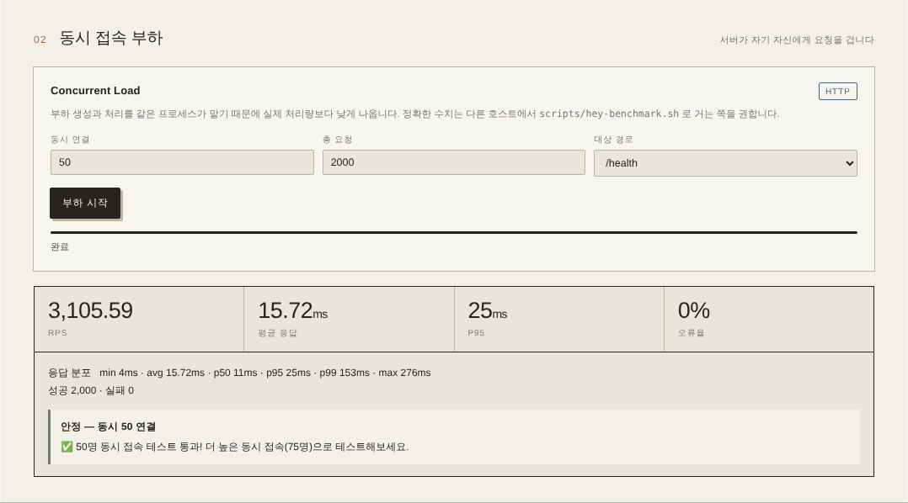
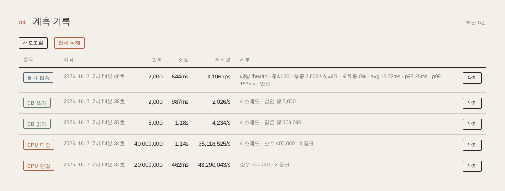

# benchmark-stack

CPU·DB·동시접속 부하를 재고 결과를 기록하는 벤치마크 앱과, 그것을 **Docker Compose** 와 **Kubernetes(kustomize)** 양쪽으로 배포하는 매니페스트 모음.

같은 애플리케이션을 단일 호스트 / 매니지드 쿠버네티스(EKS·GKE·NKS)에 각각 올려서, 환경별 성능과 오토스케일 동작을 비교하려고 만든 테스트 스택이다.

> [!WARNING]
> **공개 인터넷에 노출하지 말 것.** 인증·레이트리밋이 전혀 없고, `/api/performance/*` 는 의도적으로 CPU 와 DB 를 소진시키는 엔드포인트다. `DELETE /api/performance` 는 기록 전체를 지운다. 사설망이나 로컬에서만 쓰는 것을 전제로 한다.

---

## 구성

| 구성 요소 | 역할 |
|---|---|
| `app/` | Express + mysql2 벤치마크 서버 (`server.js`) + worker_threads 워커 (`worker.js`) + 웹 UI (`public/index.html`) |
| `nginx/` | 리버스 프록시 (HTTP, 자체서명/Let's Encrypt 선택) |
| `caddy/` | 리버스 프록시 (HTTPS, TLS-ALPN-01 자동 인증서) |
| `acme-dns/` | DNS-01 챌린지용 acme-dns (와일드카드 인증서, compose profile) |
| `k8s/` | kustomize base + components(nginx·caddy·mysql) + overlays(eks·gks·nks) |
| `scripts/` | `hey` / `wrk` 외부 부하 스크립트, 결과를 앱 API 로 되돌려 저장 |

프록시는 nginx / caddy 중 하나를 고르는 구조다. DB 는 컨테이너 MySQL 8 또는 매니지드 DB(RDS 등) 중 선택한다.

## 빠른 시작 (Docker Compose)

```bash
cp .env.example .env      # 최소한 MYSQL_* 비밀번호는 바꾼다
docker compose up -d
```

앱은 `http://localhost:3000`, 웹 UI 는 같은 주소의 루트에서 열린다. MySQL 스키마와 시드 데이터 1000건은 앱 기동 시 자동 생성된다(`app/db/schema.sql`).

DNS-01 이 필요하면 `docker compose --profile acme-dns up -d`.

## 실행 가이드 (웹 UI로 벤치마크 돌려보기)

프록시 없이 앱과 MySQL 만 띄워 웹 UI 에서 직접 계측하는 최소 절차다. 아래 스크린샷은 이 절차 그대로 4 vCPU / 15 GiB 리눅스 컨테이너에서 찍은 실제 결과이며, 수치는 환경마다 다르다.

**1. 기동**

```bash
cp .env.example .env
docker compose up -d --build mysql app
docker compose ps                     # 두 컨테이너 모두 (healthy) 인지 확인
curl http://localhost:3000/health     # {"status":"healthy",...}
```

**2. 웹 UI 열기** — 브라우저에서 `http://localhost:3000`. 우측 상단이 `서버 정상` 이면 DB 연결까지 끝난 상태다.


**3. 단위 계측 (01)** — CPU 단일 / CPU 다중 / DB 읽기 / DB 쓰기 카드에서 반복 수·스레드를 정하고 `실행`. 소요 시간은 반복 수에 비례하므로(위 환경에서 CPU 단일 2천만 회 ≈ 0.46초), 처음에는 반복 수를 줄여 감을 잡은 뒤 기본값으로 올리는 것을 권한다. 스크린샷에서는 CPU 단일 2천만, CPU 다중 4천만 / 4 스레드, DB 읽기 5천 / 4 스레드, DB 쓰기 2천 / 4 스레드로 돌렸다.

**4. 동시 접속 부하 (02)** — 동시 연결·총 요청·대상 경로를 정하고 `부하 시작`. RPS, 평균 / p95 / p99 응답시간, 오류율과 판정이 표시된다. 서버가 자기 자신에게 요청을 거는 방식이라 실제 처리량보다 낮게 나오므로, 정확한 수치는 [외부 부하 스크립트](#외부-부하-스크립트)로 잰다.



**5. 계측 기록 (04)** — 모든 결과는 `performance_tests` 테이블에 저장되고 하단 표에 쌓인다. `새로고침` 으로 다시 불러오고, 행별 `삭제` 또는 `전체 삭제` 로 정리한다. 같은 내용은 `GET /api/performance/history` 로도 받을 수 있다.



**6. 종합 계측 (03)** — `스윕 시작` 은 네 단위 계측을 10회 반복해 `*_AVG` 로 평균을 기록한다. 세트 사이 대기가 있어 수십 분이 걸리므로 환경 간 비교용 최종 측정에 쓴다.

**7. 정리**

```bash
docker compose down        # 컨테이너만 정리
docker compose down -v     # MySQL 볼륨까지 삭제 (기록 초기화)
```

## 벤치마크 API

| 메서드 | 경로 | 설명 |
|---|---|---|
| GET | `/health` | 헬스체크 |
| GET | `/api/performance/cpu` | 단일 스레드 소수 계산. `?iterations=` (기본 1억) |
| GET | `/api/performance/cpu-multi` | worker_threads 병렬 소수 계산. `?iterations=` `?threads=` (기본 4) |
| GET | `/api/performance/db-read` | 반복 SELECT. `?iterations=` (기본 50000) `?threads=` |
| POST | `/api/performance/db-write` | 반복 INSERT |
| POST | `/api/performance/concurrent` | 자체 동시 요청 부하. body `{concurrency, totalRequests, targetEndpoint}` (상한 500 / 50000) |
| POST | `/api/performance/result` | 외부에서 측정한 결과를 저장 (부하 스크립트가 사용) |
| GET | `/api/performance/history` | 결과 이력. `?limit=` (기본 50) |
| DELETE | `/api/performance/:id` | 개별 삭제 |
| DELETE | `/api/performance` | 전체 삭제 |

측정 결과는 `performance_tests` 테이블에 자동 저장된다. 저장을 건너뛰려면 `?skip_save=true`.

```bash
curl "http://localhost:3000/api/performance/cpu?iterations=50000000"
curl "http://localhost:3000/api/performance/cpu-multi?iterations=100000000&threads=8"
curl "http://localhost:3000/api/performance/history?limit=10"
```

## 외부 부하 스크립트

앱 내장 부하는 서버 자신의 리소스를 쓰기 때문에, 실제 처리량은 별도 호스트에서 `hey` / `wrk` 로 거는 쪽이 정확하다. 스크립트는 측정 후 대상 호스트의 `/api/performance/result` 로 결과를 POST 한다.

```bash
./scripts/hey-benchmark.sh  http://target/health 5000 500 4     # 요청수 동시성 CPU코어
./scripts/wrk-benchmark.sh  http://target/health 4 500 10s      # 스레드 커넥션 시간
./scripts/hey-find-optimal.sh http://target/health              # 동시성 올려가며 한계점 탐색
```

## Kubernetes

kustomize 로 구성돼 있다. `base` 는 앱 Deployment / Service / Ingress(ALB) / HPA(CPU 70%, 1~5 replica) / ConfigMap 이고, 프록시와 DB 는 `components` 로 붙인다.

```bash
kubectl apply -k k8s/overlays/eks/mysql/nginx     # EKS + 컨테이너 MySQL + nginx
kubectl apply -k k8s/overlays/eks/rds/caddy       # EKS + RDS + caddy
kubectl apply -k k8s/overlays/nks/rds             # NKS + 매니지드 DB
```

오버레이는 `eks` / `gks` / `nks` 별로 StorageClass 와 Service 타입, PVC 를 패치한다.

시크릿은 커밋하지 않는다. `k8s/secret.example.yml` 를 참고해 직접 만든다.

```bash
kubectl create secret generic app-secret \
  --from-literal=db_user=... --from-literal=db_password=...
```

## 환경 변수

`.env.example` 참고.

| 변수 | 설명 | 기본값 |
|---|---|---|
| `MYSQL_ROOT_PASSWORD` / `MYSQL_USER` / `MYSQL_PASSWORD` / `MYSQL_DATABASE` | MySQL 자격증명 | 예시값 — **반드시 변경** |
| `DOMAIN` | 프록시가 사용할 도메인 | `localhost` |
| `ACME_EMAIL` | Let's Encrypt 등록 이메일 | — |
| `USE_LETSENCRYPT` | `false` 면 자체서명 인증서 | `false` |
| `USE_ACME_DNS` / `ACME_DNS_API_URL` | DNS-01 사용 여부 | `false` |
| `PORT` / `APP_PORT` | 앱 포트 (PaaS 는 `PORT` 를 주입) | `3000` |

## 문서

- [`MIGRATION.md`](MIGRATION.md) — Compose → Kubernetes 이행
- [`CLOUD_MIGRATION_GUIDE.md`](CLOUD_MIGRATION_GUIDE.md) — EKS / RDS 상세 절차
- [`ACME_DNS_GUIDE.md`](ACME_DNS_GUIDE.md) — acme-dns 등록과 와일드카드 인증서

## 라이선스

[MIT](LICENSE)
