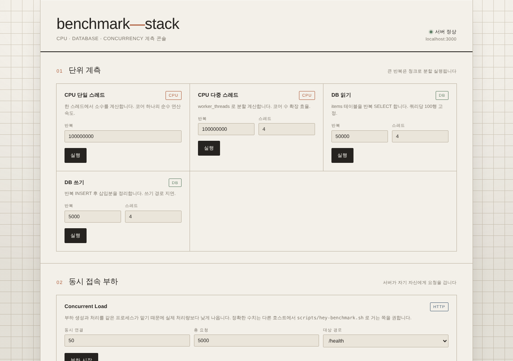
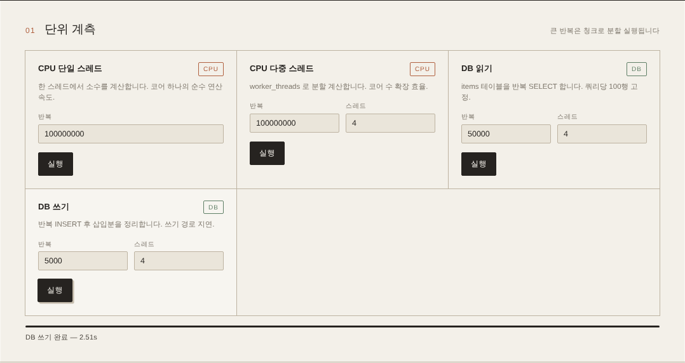
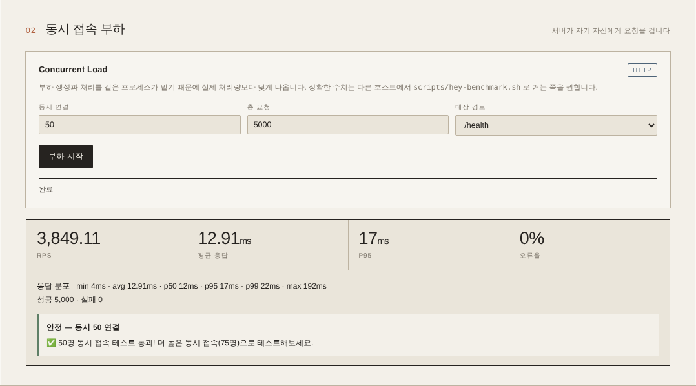
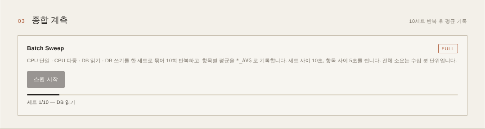
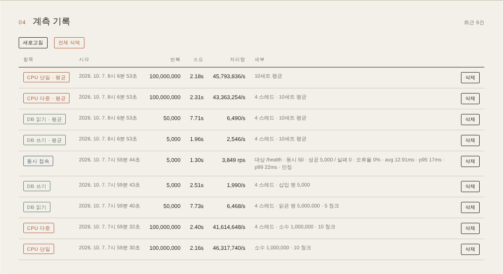

# benchmark-stack

CPU·DB·동시접속 부하를 재고 결과를 기록하는 벤치마크 앱과, 그것을 **Docker Compose** 와 **Kubernetes(kustomize)** 양쪽으로 배포하는 매니페스트 모음.

같은 애플리케이션을 단일 호스트 / 매니지드 쿠버네티스(EKS·GKE·NKS)에 각각 올려서, 환경별 성능과 오토스케일 동작을 비교하려고 만든 테스트 스택이다.

> [!WARNING]
> **공개 인터넷에 노출하지 말 것.** 인증·레이트리밋이 전혀 없고, `/api/performance/*` 는 의도적으로 CPU 와 DB 를 소진시키는 엔드포인트다. `DELETE /api/performance` 는 기록 전체를 지운다. 사설망이나 로컬에서만 쓰는 것을 전제로 한다.
>
> **이 저장소의 모든 코드는 AI 가 작성했다.** 사용 전에 직접 검토할 것.

---

## 구성

| 구성 요소 | 역할 |
|---|---|
| `app/` | Express + mysql2 벤치마크 서버 (`server.js`) + worker_threads 워커 (`worker.js`) + 웹 UI (`public/index.html`) |
| `nginx/` | 리버스 프록시 (HTTP, 자체서명/Let's Encrypt 선택) |
| `caddy/` | 리버스 프록시 (HTTPS, TLS-ALPN-01 자동 인증서) |
| `acme-dns/` | DNS-01 챌린지용 acme-dns (와일드카드 인증서, compose profile) |
| `k8s/` | kustomize base + components(nginx·caddy·mysql) + overlays(eks·gks·nks) |
| `scripts/` | `hey` / `wrk` 외부 부하 스크립트, 결과를 앱 API 로 되돌려 저장 |

프록시는 nginx / caddy 중 하나를 고르는 구조다. DB 는 컨테이너 MySQL 8 또는 매니지드 DB(RDS 등) 중 선택한다.

## 빠른 시작 (Docker Compose)

```bash
cp .env.example .env      # 최소한 MYSQL_* 비밀번호는 바꾼다
docker compose up -d
```

앱은 `http://localhost:3000`, 웹 UI 는 같은 주소의 루트에서 열린다. MySQL 스키마와 시드 데이터 1000건은 앱 기동 시 자동 생성된다(`app/db/schema.sql`).

DNS-01 이 필요하면 `docker compose --profile acme-dns up -d`.

## 이용 가이드 (웹 UI)

앱과 MySQL 만 띄워 웹 UI 에서 계측하는 절차와, 화면 각 부분이 무엇을 재고 어떻게 읽는지 정리한다.

> 아래 스크린샷과 수치는 4 vCPU / 15 GiB 리눅스 컨테이너에서 이 절차를 기본값 그대로 실행한 실제 결과다. 절대값은 하드웨어마다 다르므로 **같은 설정으로 환경끼리 비교**하는 용도로 본다.

### 1. 기동

```bash
cp .env.example .env
docker compose up -d --build mysql app
docker compose ps                     # mysql, app 모두 (healthy) 인지 확인
curl http://localhost:3000/health     # {"status":"healthy",...}
```

프록시(nginx / caddy)까지 거쳐서 재고 싶으면 `docker compose up -d` 로 전체를 올린다. 여기서는 앱에 직접 붙는다.

### 2. 화면 구성

브라우저에서 `http://localhost:3000` 을 연다.



- **우측 상단 상태 표시**: `/health` 를 30초마다 호출한다. `서버 정상` 이면 계측 준비가 끝난 것이고, `서버 응답 없음` 이면 앱 컨테이너 로그를 먼저 본다. 그 아래는 지금 접속한 호스트:포트다.
- 화면은 위에서부터 **01 단위 계측 → 02 동시 접속 부하 → 03 종합 계측 → 04 계측 기록** 순서다. 01~03 에서 실행한 결과는 모두 DB 에 저장돼 04 표에 쌓인다.
- 계측이 하나 돌아가는 동안에는 다른 버튼이 잠긴다. 서로 자원을 뺏어 수치가 섞이지 않게 하기 위해서다.

### 3. 단위 계측 (01)



네 개의 카드가 각각 하나의 자원을 잰다. 값을 정하고 `실행` 을 누르면 하단 게이지에 진행 상황과 소요 시간(`DB 쓰기 완료 — 2.51s`)이 나온다.

| 카드 | 무엇을 하나 | 입력값 | 보는 법 |
|---|---|---|---|
| **CPU 단일 스레드** | 한 스레드에서 소수를 찾는다. 반복 수의 1/100 개(1억 → 소수 100만 개)를 찾을 때까지 계산 | 반복 (기본 1억) | 코어 하나의 연산 성능. 소요 시간이 짧을수록 좋다 |
| **CPU 다중 스레드** | 반복 수를 스레드 수로 나눠 `worker_threads` 로 동시에 소수 계산 | 반복 (기본 1억), 스레드 (기본 4) | 스레드를 늘렸을 때 시간이 줄어드는 정도로 멀티코어 활용도를 본다 |
| **DB 읽기** | `SELECT * FROM items LIMIT 100` 을 반복. 스레드마다 별도 DB 연결 사용 | 반복 (기본 5만), 스레드 (기본 4) | 초당 쿼리 수. DB 와 네트워크 지연에 민감하다 |
| **DB 쓰기** | `items` 에 한 행씩 INSERT 를 반복한 뒤, 넣은 행을 다시 지워 원상복구 | 반복 (기본 5천), 스레드 (기본 4) | 쓰기 경로(디스크·트랜잭션) 성능. 정리(DELETE) 시간도 포함된다 |

- **청크 분할**: 요청 하나가 너무 길어지지 않도록 브라우저가 CPU 는 1천만 회, DB 는 1만 회 단위로 잘라 여러 번 호출하고 시간을 합산한다. 기록의 `10 청크` 같은 표시가 이것이다.
- **스레드 기본값 4**: 서버의 vCPU 수에 맞춰 바꿔 보면 확장성을 볼 수 있다.
- **주의**: CPU 다중은 스레드마다 처음부터 소수를 다시 찾으므로 단일과 작업량이 같지 않다. 단일과 다중을 직접 비교하지 말고, **같은 항목을 환경끼리** 비교한다.
- 참고 수치(위 환경, 기본값): CPU 단일 2.16s · CPU 다중 2.40s · DB 읽기 7.73s · DB 쓰기 2.51s.

### 4. 동시 접속 부하 (02)



앱 서버가 **자기 자신에게** HTTP 요청을 동시에 보내 응답성을 잰다.

| 입력 | 의미 |
|---|---|
| 동시 연결 | 동시에 열어 두는 요청 수 (최대 500) |
| 총 요청 | 보낼 요청의 총 개수 (최대 50,000) |
| 대상 경로 | `/health`(가장 가벼움), `/api/performance/history`(DB 조회 포함), `/`(이 웹 UI 의 정적 HTML) 중 선택 |

결과 패널 읽는 법:

- **RPS**: 초당 처리한 요청 수.
- **평균 응답 / P95**: 평균과, 요청 95% 가 이 시간 안에 끝났다는 값. 체감 지연은 평균보다 P95 쪽이 잘 드러낸다.
- **오류율**: 실패한 요청 비율.
- **응답 분포**: min · p50 · p95 · p99 · max 와 성공·실패 건수.
- **판정**: 오류율 1% 미만이고 p95 500ms 미만이면 `안정`(다음엔 1.5배 동시 연결을 권함), 오류율 5% 미만이고 p95 2초 미만이면 `주의`, 그 밖은 `불안정`(0.7배로 줄일 것을 권함). 권장값대로 동시 연결을 조정하며 반복하면 한계점을 찾을 수 있다.

부하를 만드는 쪽과 받는 쪽이 같은 프로세스라 실제 처리량보다 낮게 나온다. 정확한 수치는 다른 호스트에서 [외부 부하 스크립트](#외부-부하-스크립트)로 잰다.

### 5. 종합 계측 (03)



`스윕 시작` 을 누르면 확인 창이 뜨고, 승인하면 다음을 자동으로 수행한다.

1. CPU 단일(1억) → CPU 다중(1억, 4 스레드) → DB 읽기(5만, 4 스레드) → DB 쓰기(5천, 4 스레드)를 한 세트로 실행
2. 항목 사이 5초, 세트 사이 10초 쉬면서 **10세트** 반복
3. 항목별 평균을 `CPU 단일 · 평균` 처럼 `*_AVG` 기록으로 저장 (각 세트의 원본 시간도 함께 저장)

게이지 아래에 `세트 1/10 — DB 읽기` 처럼 현재 위치가 표시된다. 위 환경에서는 약 7분 걸렸고, 느린 환경일수록 오래 걸린다. 한 번 잰 값보다 흔들림이 적으므로 **환경 간 비교의 최종 수치**로 쓴다.

### 6. 계측 기록 (04)



모든 결과가 `performance_tests` 테이블에 저장되고 최신순으로 최대 50건이 보인다.

| 열 | 의미 |
|---|---|
| 항목 | 계측 종류. 색으로 구분(주황 CPU, 초록 DB, 파랑 HTTP). `· 평균` 은 종합 계측 결과 |
| 시각 | 기록 시각 |
| 반복 | 실행한 반복 수 (동시 접속은 총 요청 수) |
| 소요 | 전체 걸린 시간 |
| 처리량 | `반복 ÷ 소요`(/s). 동시 접속은 RPS. 같은 항목·같은 반복 수끼리 비교한다 |
| 세부 | 스레드 수, 찾은 소수·읽은 행·삽입 행 수, 청크 수, 동시 접속의 응답 분포와 판정 등 |

- `새로고침`: 기록을 다시 불러온다. 외부 스크립트(`hey`/`wrk`)로 잰 결과도 여기에 나타난다.
- `삭제` / `전체 삭제`: 개별 또는 전체 기록을 지운다(확인 창이 뜬다). 되돌릴 수 없다.
- 같은 데이터는 `GET /api/performance/history` 로도 받을 수 있어, 환경별 결과를 모아 비교할 때 쓴다.

### 7. 정리

```bash
docker compose down        # 컨테이너만 정리 (기록 유지)
docker compose down -v     # MySQL 볼륨까지 삭제 (기록 초기화)
```

## 벤치마크 API

| 메서드 | 경로 | 설명 |
|---|---|---|
| GET | `/health` | 헬스체크 |
| GET | `/api/performance/cpu` | 단일 스레드 소수 계산. `?iterations=` (기본 1억) |
| GET | `/api/performance/cpu-multi` | worker_threads 병렬 소수 계산. `?iterations=` `?threads=` (기본 4) |
| GET | `/api/performance/db-read` | 반복 SELECT. `?iterations=` (기본 50000) `?threads=` |
| POST | `/api/performance/db-write` | 반복 INSERT |
| POST | `/api/performance/concurrent` | 자체 동시 요청 부하. body `{concurrency, totalRequests, targetEndpoint}` (상한 500 / 50000) |
| POST | `/api/performance/result` | 외부에서 측정한 결과를 저장 (부하 스크립트가 사용) |
| GET | `/api/performance/history` | 결과 이력. `?limit=` (기본 50) |
| DELETE | `/api/performance/:id` | 개별 삭제 |
| DELETE | `/api/performance` | 전체 삭제 |

측정 결과는 `performance_tests` 테이블에 자동 저장된다. 저장을 건너뛰려면 `?skip_save=true`.

```bash
curl "http://localhost:3000/api/performance/cpu?iterations=50000000"
curl "http://localhost:3000/api/performance/cpu-multi?iterations=100000000&threads=8"
curl "http://localhost:3000/api/performance/history?limit=10"
```

## 외부 부하 스크립트

앱 내장 부하는 서버 자신의 리소스를 쓰기 때문에, 실제 처리량은 별도 호스트에서 `hey` / `wrk` 로 거는 쪽이 정확하다. 스크립트는 측정 후 대상 호스트의 `/api/performance/result` 로 결과를 POST 한다.

```bash
./scripts/hey-benchmark.sh  http://target/health 5000 500 4     # 요청수 동시성 CPU코어
./scripts/wrk-benchmark.sh  http://target/health 4 500 10s      # 스레드 커넥션 시간
./scripts/hey-find-optimal.sh http://target/health              # 동시성 올려가며 한계점 탐색
```

## Kubernetes

kustomize 로 구성돼 있다. `base` 는 앱 Deployment / Service / Ingress(ALB) / HPA(CPU 70%, 1~5 replica) / ConfigMap 이고, 프록시와 DB 는 `components` 로 붙인다.

```bash
kubectl apply -k k8s/overlays/eks/mysql/nginx     # EKS + 컨테이너 MySQL + nginx
kubectl apply -k k8s/overlays/eks/rds/caddy       # EKS + RDS + caddy
kubectl apply -k k8s/overlays/nks/rds             # NKS + 매니지드 DB
```

오버레이는 `eks` / `gks` / `nks` 별로 StorageClass 와 Service 타입, PVC 를 패치한다.

시크릿은 커밋하지 않는다. `k8s/secret.example.yml` 를 참고해 직접 만든다.

```bash
kubectl create secret generic app-secret \
  --from-literal=db_user=... --from-literal=db_password=...
```

## 환경 변수

`.env.example` 참고.

| 변수 | 설명 | 기본값 |
|---|---|---|
| `MYSQL_ROOT_PASSWORD` / `MYSQL_USER` / `MYSQL_PASSWORD` / `MYSQL_DATABASE` | MySQL 자격증명 | 예시값 — **반드시 변경** |
| `DOMAIN` | 프록시가 사용할 도메인 | `localhost` |
| `ACME_EMAIL` | Let's Encrypt 등록 이메일 | — |
| `USE_LETSENCRYPT` | `false` 면 자체서명 인증서 | `false` |
| `USE_ACME_DNS` / `ACME_DNS_API_URL` | DNS-01 사용 여부 | `false` |
| `PORT` / `APP_PORT` | 앱 포트 (PaaS 는 `PORT` 를 주입) | `3000` |

## 문서

- [`MIGRATION.md`](MIGRATION.md) — Compose → Kubernetes 이행
- [`CLOUD_MIGRATION_GUIDE.md`](CLOUD_MIGRATION_GUIDE.md) — EKS / RDS 상세 절차
- [`ACME_DNS_GUIDE.md`](ACME_DNS_GUIDE.md) — acme-dns 등록과 와일드카드 인증서

## 라이선스

[MIT](LICENSE)
